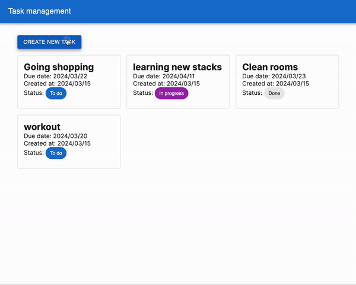
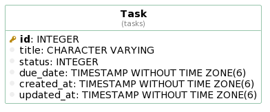

# Task manager coding challenge

<!-- @import "[TOC]" {cmd="toc" depthFrom=1 depthTo=6 orderedList=false} -->

<!-- code_chunk_output -->

- [Task manager coding challenge](#task-manager-coding-challenge)
  - [Requirement](#requirement)
  - [What I implemented](#what-i-implemented)
  - [How to start](#how-to-start)
  - [ERD](#erd)
  - [API document](#api-document)
  - [Further information](#further-information)

<!-- /code_chunk_output -->

## Requirement

Build a simple task management application using NestJS (TypeORM) for the backend and NextJS for the frontend. The application should allow users to perform CRUD operations on tasks. A task has the following fields:

```
ID
Title
Status ("To do", "In Progress", "Done")
Due date
Created at
Updated at
```

## What I implemented

Following the requirement, I implemented a simple CRUD system with a single table.

Here's a quick look at the use flow in action:



## How to start

Please set env variable for both directory.

- For the **api** directory: Duplicate the `.env.local.example` file and rename the copy to `.env`, ensuring it remains in the same directory.
- For the **app** directory: Duplicate the `.env.local.example` file and rename the copy to `.env.local`, making sure it's also in the same directory.

Run commands below

```bash
# start app
$ make start-app
# start api
$ make start-api
# insert data
$ make init-data
```

## ERD



## API document

The api documentation can be found here.
[API document](./api/openapi.yaml)

## Further information

For more information, please check README in api and app directory.

- [API README](./api/README.md)
- [APP README](./app/README.md)
